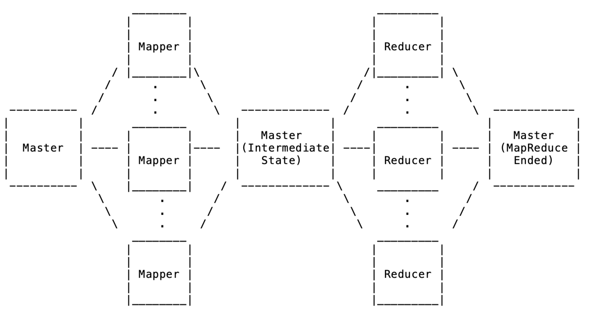

Date: 11/19/20

Authors:

Hamed Seyedroudbari (hseyedro3@gatech.edu)
Divya Kiran Kadiyala (dkadiyala3@gatech.edu)

Advanced Operating Systems
***********************************************************************************
Project 4 - MapReduce Franework using gRPC

Project Description
***********************************************************************************
In this project, we implemented a simplified MapReduce framework using gRPC. 
This service will simulate the counting the ocurrences of unique words (keys) 
in multiple text files. The framework involves one master (client) and multiple 
workers (servers) each listening on a unique port on the localhost. The master 
is able to assign workers either a map task or reduce task to accomplish this 
specific task. The flow of this our MapReduce framework is as follows:

(1) The master starts up and initializes itself with the available workers.
(2) The master creates multiple shards from the available input text files.
(3) Master sends a shard to an available worker (mapper in this case) via gRPC, 
    requesting the mapper to create an intermediate text file with all words(keys)
    as well as the number of occurences of each. Each key is written to a different 
    file depending on the key's hash, which will cause keys to be distributed and 
    written to different intermediate files in respective directories, in preparation 
    for the reduction operation.
(4) Master waits to receive completion responses from all mappers before assigning 
    reduction tasks to workers.
(5) Master sends the a folder of intermediate files generated by mappers to each 
    corresponding reducer via gRPC.
(6) Now, each reducer's job is to parse all intermediate files in its folder and
    accumulate the number of occurences of each unique word it encounters in 
    these respective files. Finally the reducer writes each unique key along with 
    its accumulated count in an output text file.
(7) Master waits to receive notification from all reducers to declare the end of 
    MapReduce, which is when it can access all output files written by the reducers.

Structure of Submission
****************************************************************************************
  Firstname_Lastname/
    |- README.md
    |- src/
      |- CMakeLists.txt       
      |- GenerateProtos.cmake               
      |- masterworker.proto 
      |- master.h                        
      |- worker.h                        
      |- mr_tasks.h                       
      |- file_shard.h               
      |- mapreduce_spec.h                 
      |- Other unmodified files

Compile & Run Instructions
*****************************************************************************************
Please make sure your environment is correctly configured.

  1. In CMakeList.txt, change (VCPKG_HOME "$ENV{HOME}/vcpkg") to where your vcpkg exists.
  2. Export `PATH` variable to point to cmake.
     (e.g.`export PATH=$PATH:$HOME/vcpkg/downloads/tools/cmake-3.14.0-linux/cmake-3.14.0-Linux-x86_64/bin`

To compile and Run:

1. Unzip the submitted zip file
2. Run "cmake ; make" to compile the MapReduce framework
3. Workers (servers): Run ./mr_worker localhost:[port#] in separate terminal tabs to start workers.
4. Master  (client) :Run ./mrdemo [config.ini file] to start the master.

******************************************************************************************
